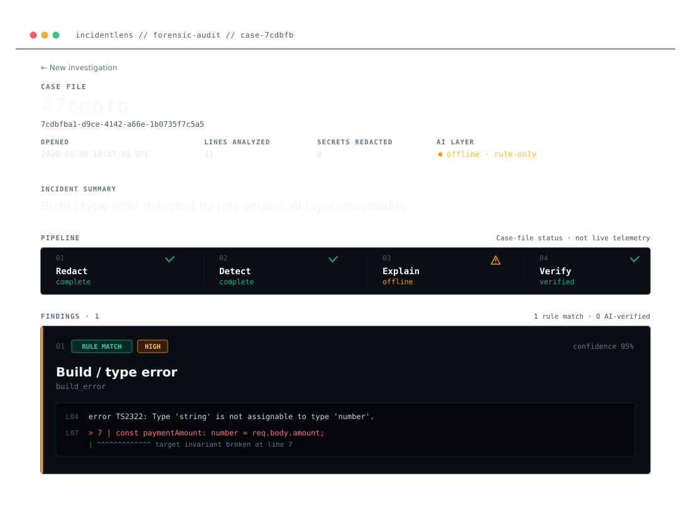

# IncidentLens

**Paste your failed deploy logs. Get back a diagnosis where every claim cites the exact log line that proves it.**


Built for **First Commit** (Bharat Builds Tour × AWS Builder Center, Sept 17–20, 2026) — **Ship It track**, deployed end-to-end on AWS, with **Best UI** as a secondary target.



- **Live app:** https://main.d3q0kud5rfn74o.amplifyapp.com
- **Demo video:** https://youtu.be/k9sIvLC6tYI
- **API:** https://i04ivon4j7.execute-api.us-east-1.amazonaws.com
- **Repo:** https://github.com/Aadarsh6/IncidentLense

- `POST /analyze` — investigate logs
- `GET /incidents` — list case files
- `GET /incidents/{id}` — one case file

---

## Contents

- [Live Demo](#live-demo)
- [Built for First Commit](#built-for-first-commit)
- [The Problem](#the-problem)
- [Why Not a Chatbot](#why-not-a-chatbot)
- [How It Works](#how-it-works)
- [Architecture](#architecture)
- [AWS Services Used](#aws-services-used)
- [Repository Structure](#repository-structure)
- [Running Locally](#running-locally)
- [The Anti-Hallucination Gate](#the-anti-hallucination-gate)
- [Demo Video](#demo-video)
- [What Fought Back](#what-fought-back)
- [What I Learned](#what-i-learned)
- [Cost](#cost)
- [Limitations](#limitations)
- [Roadmap](#roadmap)
- [AI Tools Disclosure](#ai-tools-disclosure)
- [Author](#author)

---

## Live Demo

Open the app, click "try a sample incident", then Investigate. In under 5 seconds you get a case file: severity-ranked findings, each with cited log line numbers, confidence, and a remediation. Every investigation is saved and can be reopened from the case-files list.

No login, no setup — the sample button is there so anyone can see the whole flow in one click.

## Built for First Commit

| Judging criterion | Where to look |
|---|---|
| Idea & Impact | [The Problem](#the-problem), [Why Not a Chatbot](#why-not-a-chatbot) |
| Built on AWS | [AWS Services Used](#aws-services-used), [Architecture](#architecture) |
| Learning | [What I Learned](#what-i-learned), [What Fought Back](#what-fought-back) |
| Execution | [Live Demo](#live-demo), [The Anti-Hallucination Gate](#the-anti-hallucination-gate), [Cost](#cost) |
| Demo | [Demo Video](#demo-video) |

## The Problem

A deployment fails at 2 AM. You're alone — no SRE team, no observability budget, no senior to ping. You're scrolling through hundreds of lines of build output, stack traces, and environment dumps, guessing.

Enterprise incident tools assume a team and a budget. Pasting the logs into a chatbot works, but it sends your secrets to a third party and hands back a confident-sounding answer you have no way to check.

I built IncidentLens for the gap in between: something that investigates a failed deploy for someone working alone, without needing either of those.

## Why Not a Chatbot

| | Paste logs into ChatGPT | IncidentLens |
|---|---|---|
| **Secrets** | The full log — DB passwords, AWS keys, Stripe keys — leaves your machine | Redacted before anything sees the logs (demo1: 3 secrets caught pre-analysis) |
| **Evidence** | Plausible prose; hallucinated line numbers happen and you can't easily catch them | Every claim has to quote its cited line exactly; a validator rejects any finding whose evidence doesn't match the real log |
| **Confidence** | Vibes | Computed from evidence count (2 matching lines → 0.95) |
| **Availability** | Model down = tool down | The deterministic path runs with no model at all — this actually happened during the event, see [What Fought Back](#what-fought-back) |
| **Workflow** | Chat scrollback you re-explain every time | Case files with severity, shareable URLs, and 7-day TTL cleanup |

The idea in one line: the AI proposes, deterministic rules verify, the human decides.

## How It Works

Four stages, in order, inside one Lambda function:

**1. Redact** — a regex sweep scrubs AWS keys, JWTs, bearer tokens, and `KEY=value` secrets before anything else touches the log. It skips values like `undefined` so a missing-env finding still shows up. The UI shows a counter for how much it caught.

**2. Detect** — six deterministic detectors scan every line, no model involved. Confidence is computed rather than guessed: one matching line gets 0.75, two or more gets 0.95.

| Detector | Example signature caught |
|---|---|
| `missing_env` | `Required env STRIPE_WEBHOOK_SECRET is not set` |
| `module_not_found` | `Cannot find module 'x'` / `ERR_MODULE_NOT_FOUND` |
| `db_conn` | `ECONNREFUSED`, `Prisma P1001`, `auth failed` |
| `port_bind` | `EADDRINUSE`, `listen EACCES` |
| `iam_denied` | `AccessDenied`, `not authorized to perform` |
| `build_error` | `npm ERR!`, `error TS2304: Cannot find name 'apiRoutes'` |

**3. Explain** — Bedrock (Amazon Nova Lite) summarizes the incident and only adds findings the rule engine missed. This layer is optional on purpose: any failure, timeout, or malformed output just returns `null` and the report goes out rule-only. The UI is honest about it — `Explain ⚠ offline` when that happens.

**4. Verify** — the citation validator checks every AI finding: does the cited line actually exist, and does the quoted text actually appear on it (whitespace-normalized)? One quote that doesn't check out and the whole finding gets rejected. The rejection count shows up in the report.

Rule findings skip this check because their evidence is true by construction — the evidence *is* the line the regex matched. Agent findings are claims about the log, so they have to prove themselves.

## Architecture

```text
┌─────────────────────────────┐
│      Next.js 15 (static)     │
│      Amplify Hosting         │
└──────────────┬────────────────┘
               │ POST /analyze
               │ GET  /incidents/{id}
               ▼
┌─────────────────────────────┐
│    API Gateway (HTTP API)    │
└──────────────┬────────────────┘
               ▼
┌───────────────────────────────────────┐
│      Lambda (Node 22, arm64)           │
│                                         │
│   1. redact.ts                         │
│   2. detectors.ts                      │
│   3. bedrock.ts   ───► Amazon Bedrock   │
│   4. citation.ts        (Nova Lite,    │
│      (pipeline.ts)       optional)     │
└──────────────┬──────────────────────────┘
               ▼
┌─────────────────────────────┐
│    DynamoDB (on-demand)      │
│    case files, TTL 7 days    │
└─────────────────────────────┘
```

Why it's built this way:

- **SAM / CloudFormation** — the whole backend is one `template.yaml`. The function, the API, the table, and the IAM roles all come up with `sam deploy` and tear down with `sam delete`.
- **Lambda + scale-to-zero** — an incident tool sits idle most of the time. Idle cost is basically ₹0.
- **DynamoDB TTL** — every case file has an `expiresAt`. Old incidents delete themselves, no cron job needed.
- **Bedrock as a layer, not a dependency** — it lives behind one function (`bedrock.ts`), so it's swappable, but I kept it on AWS so the AI stays inside the same trust boundary as everything else.

## AWS Services Used

Amazon Bedrock (Nova Lite, explanation layer) · Lambda (investigation pipeline) · API Gateway HTTP API (frontend ↔ backend) · DynamoDB (persistence + TTL) · Amplify Hosting (frontend) · CloudFormation via AWS SAM (infrastructure as code) · IAM (least-privilege roles per component) · CloudWatch (logs) · S3 (deployment artifacts).

## Repository Structure

```text
incidentlens/
├── template.yaml          # SAM: Lambda + API GW + DynamoDB + IAM
├── src/
│   ├── lib/
│   │   ├── redact.ts      # secret scrubbing (runs first, always)
│   │   ├── detectors.ts   # 6 deterministic failure signatures
│   │   ├── bedrock.ts     # optional AI layer (fails open to rules-only)
│   │   ├── citation.ts    # anti-hallucination validator
│   │   ├── pipeline.ts    # orchestrates 1 → 4
│   │   └── types.ts       # shared contracts
│   └── handler.ts         # Lambda entry: HTTP in → investigate() → DynamoDB
├── prompts/
│   └── system.txt         # AI contract: JSON-only, verbatim quotes
├── incidents/              # demo1 (synthetic, planted secrets), demo2 (real deploy failure)
├── tests/                  # citation validator: accepts true evidence, rejects invented
├── Frontend/                # Next.js 15 + Tailwind 4 static site
└── docs/                    # architecture, demo script, AI disclosure, screenshots
```

## Running Locally

Prerequisites: Node 20+, AWS credentials configured, SAM CLI.

```bash
# backend
npm install
npm test                                   # 3 tests: the citation gate
npm run cli -- incidents/demo1.txt         # full pipeline, terminal report

# deploy backend
sam build && sam deploy --guided

# frontend
cd Frontend && npm install && npm run dev  # http://localhost:3000
```

## The Anti-Hallucination Gate

The core guarantee, as a test:

```bash
npm test
✓ accepts evidence that matches the cited line
✓ rejects evidence citing a line that does not exist
✓ rejects evidence whose quote is not on the cited line
```

An AI finding is only accepted if every piece of evidence survives this: the line has to exist, and the quote has to actually be on it (whitespace-normalized, case-insensitive). Rejected findings are counted and shown in the report — nothing gets silently dropped or silently trusted.

## Demo Video

Three minutes — the problem, a live investigation on a real production failure, how the mechanism works, the architecture, and what I learned: https://YOUR-VIDEO-LINK

## What Fought Back

- **`Layout.tsx` vs `layout.tsx`** — Windows doesn't care about filename case, the Linux build server does. Localhost worked fine for hours while production kept failing, because git had committed the wrong case. Fixed with a one-letter rename. The classic "works on my machine," earned the hard way.
- **`globals.css` was empty** — the CSS pipeline ran perfectly and shipped a perfect 0-byte stylesheet. The CloudFront etag was literally the MD5 hash of an empty string (`d41d8cd9...`). Found it by checking artifact byte counts instead of trusting the green build.
- **npm optional-dependencies bug (#4828)** — rolldown's native binding kept failing to install on Windows, and kept coming back every time the lockfile regenerated. Fixed by switching to the esbuild-based vitest line.
- **Amazon's new-account model gate** — Bedrock invocation was blocked the entire weekend (`Operation not allowed while the account finished verification`). The degradation path ran in production the whole time: the UI just says `Explain ⚠ offline` and the deterministic layer carries the investigation on its own. I didn't need a slide to explain the resilience story — it happened live.

## What I Learned

- SAM end-to-end: template → CloudFormation → deployed IAM roles, and why deploy-time permissions aren't the same as runtime ones.
- DynamoDB TTL, on-demand billing, and thinking through idempotent writes.
- That "AI feature" is really an architecture question, not a model question — redact before inference, rules before generation, verify after.
- Windows-vs-Linux filename case sensitivity is a real production failure mode, not just a trivia fact.
- A degradation path you actually watch run in production is worth more than a demo that only works when everything goes right.

## Cost

Scale-to-zero by design. The tool sits idle between incidents, and idle means no Lambda invocations, no API Gateway requests, no DynamoDB reads — close to ₹0/month until an actual failure gets investigated. The whole weekend, including the deployed URL and every demo, ran inside free-tier and starter credits.

## Limitations

The detector set covers six common failure classes — anything outside that relies on the AI layer, which was gated by Bedrock's new-account verification for the whole event window (the integration itself is complete and deployed, see [What Fought Back](#what-fought-back)). Long log bundles get truncated client-side. There's no authentication — anyone with the URL can open a case file, which is fine for a demo tool where the data is user-pasted, redacted, and expires in 7 days anyway.

## Roadmap

- **GitHub Actions integration** — pull a failed job's logs via the GitHub API and post the report into the Job Summary and a PR comment, so the investigation shows up where the failure happened.
- **CloudWatch Logs subscription filters → Lambda** — for AWS deploys, no pasting needed, the failure streams itself in.
- **Deploy-webhook adapters** for Render, Vercel, Netlify.
- **A detector registry that grows over time** — every new failure class becomes a rule, so the model gets used less as the rule set matures.

## AI Tools Disclosure

Per event rules: I used Zed's built-in AI assistant for code completion, scaffolding, and configuration debugging throughout the build. The core engine — `detectors.ts`, `citation.ts`, the pipeline, the SAM template, and the citation test suite — I wrote and reviewed by hand. The architecture decisions, the verification mechanism, and this document are mine.

## Author

**Aadarsh Mishra** — final-year B.Tech (AI & ML), 2027 · [GitHub](https://github.com/Aadarsh6) · [LinkedIn](https://www.linkedin.com/in/aadarsh18/)

Built solo in 3 days: Sept 18–20, 2026.
