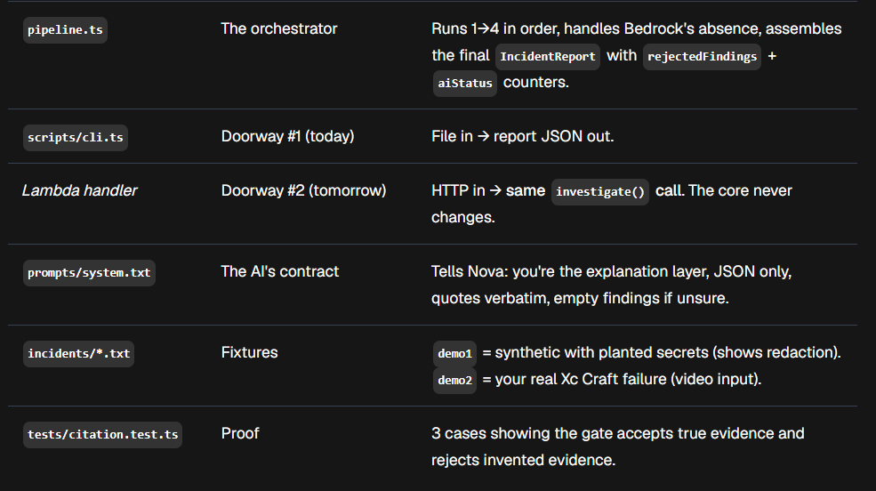

 what each file actually does
File
One job
Why it exists
types.ts	The shared contract	Defines what a Finding and an IncidentReport are. Every other file speaks this language. Change it, everything must follow.
redact.ts	Security gate, runs first	Scrubs AWS keys, JWTs, bearer tokens, KEY=value secrets before anything sees the logs — including the AI. Counts how many it caught.
detectors.ts	The deterministic brain	6 regex signatures for known failure classes. Scans every line, records up to 3 matching lines as evidence, computes confidence from match count. Zero AI. This is why the product works with Bedrock down.
bedrock.ts	The optional explainer	Sends redacted + line-numbered logs to Nova Lite. Gets back a summary + findings for what rules missed. Any failure → returns null and the report continues without it.
citation.ts	The anti-hallucination gate	Every AI claim must quote its cited line exactly (whitespace-normalized). One bad citation → whole finding rejected. Your differentiator.
pipeline.ts	The orchestrator	Runs 1→4 in order, handles Bedrock's absence, assembles the final IncidentReport with rejectedFindings + aiStatus counters.
scripts/cli.ts	Doorway #1 (today)	File in → report JSON out.
Lambda handler	Doorway #2 (tomorrow)	HTTP in → same investigate() call. The core never changes.
prompts/system.txt	The AI's contract	Tells Nova: you're the explanation layer, JSON only, quotes verbatim, empty findings if unsure.
incidents/*.txt	Fixtures	demo1 = synthetic with planted secrets (shows redaction). demo2 = your real Xc Craft failure (video input).
tests/citation.test.ts	Proof	3 cases showing the gate accepts true evidence and rejects invented evidence.

Step 3 — the whole architecture, as one story
Watch one line of demo1.txt travel through the system:

text

        TODAY                            TOMORROW (Ship It)
 incidents/demo1.txt                POST /analyze (Next.js → API Gateway)
        │                                    │
        ▼                                    ▼
   scripts/cli.ts ──────►  Lambda handler
              └──────────────┬───────────┘
                             ▼
              ┌──────────────────────────────────┐
              │     pipeline.investigate()       │
              │  1. redact.ts     (security)     │
              │  2. detectors.ts  (deterministic)│
              │  3. bedrock.ts    (optional AI)  │
              │  4. citation.ts   (verification) │
              └────────────────┬─────────────────┘
                               ▼
                     IncidentReport (JSON)
                               ▼
              CLI stdout (today) → DynamoDB + /report UI (tomorrow)
Line 9: Error: connect ECONNREFUSED 10.0.4.17:5432

Redaction: no secret on this line — passes through untouched. (Lines 3, 4, 5 get scrubbed to [REDACTED:...], count = 3.)
Numbering: the pipeline turns the whole log into 1: ..., 2: ..., 9: Error: connect ECONNREFUSED.... This numbering is what makes citations possible — the AI and the validator must agree on the same line numbers.
Detectors: db_conn's /ECONNREFUSED/ pattern matches → evidence {line: 9, quote: "Error: connect ECONNREFUSED 10.0.4.17:5432"}. Two matches (lines 9+10) → confidence 0.95. Note: build_error finds nothing here — detectors are precise, they don't spam.
Bedrock (right now): account unverified → AccessDeniedException → caught → null. Report proceeds.
Summary fallback: no AI → pipeline writes its own: "Database connection failure detected by rule engine (+1 more findings). AI layer unavailable."
Report out: 2 rule findings, redactions: 3, aiStatus: "unavailable", rejectedFindings: 0.
Once verification clears, step 4 changes: Nova returns a summary and maybe a finding citing line 11 — "Deployment marked FAILED. Rolling back." The validator checks: does line 11 exist? Does that quote appear on it? Yes → accepted, AGENT badge. If Nova had claimed "SIGKILL received at line 99" → line 99 doesn't exist → rejected, counter = 1, shown in the UI.

The one asymmetry to memorize for the interview: rule findings don't need validation because their evidence is true by construction — the evidence IS the line the regex matched. Agent findings are claims about the logs, made by a system that can invent — so they must prove themselves. Rules generate evidence; the model generates hypotheses; the validator arbitrates. That sentence is your "how do you prevent hallucinations?" answer.

